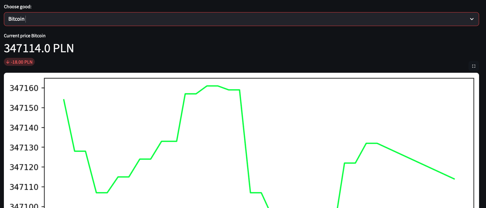

# 📈 Multi-Source Price & Asset Tracker

A professional Python-based monitoring system designed to track both e-commerce products and financial assets (Cryptocurrencies/Currencies) in real-time. This project demonstrates advanced data engineering, web automation, and interactive data visualization.

## ✨ Features

* **Hybrid Data Sourcing:**
* **Web Scraping:** Automated price extraction from e-commerce sites (e.g., Empik) using Selenium with native Safari drivers.
* **REST API Integration:** Real-time financial data fetching (Bitcoin, etc.) via the CoinGecko API.


* **Continuous Monitoring:** A persistent tracking engine with configurable intervals and error handling.
* **Relational Data Storage:** High-performance storage using **SQLAlchemy ORM** and SQLite, preserving full price history.
* **Interactive Analytics:** A live web dashboard built with **Streamlit**, featuring real-time price metrics and historical charts.

## 🛠️ Tech Stack

* **Language:** Python 3.12+
* **Database:** SQLAlchemy (SQLite)
* **Visualization:** Streamlit, Pandas, Matplotlib
* **Web Automation:** Selenium (Safari Driver)
* **Communication:** Requests (REST APIs)

## 📋 Installation & Setup

1. **Clone the repository:**
```bash
git clone https://github.com/BartoliniBartlomiej/PriceTrackerWithAPI.git
cd PriceTrackerWithAPI

```


2. **Set up Virtual Environment:**
```bash
python3 -m venv .venv
source .venv/bin/activate

```


3. **Install Dependencies:**
```bash
pip install -r requirements.txt

```


4. **Safari Automation (macOS):**
Ensure `Allow Remote Automation` is enabled in Safari's **Develop** menu.

## 🚦 Usage

### 1. Data Collection

Start the background engine to track prices:

```bash
python app/main.py

```

### 2. Visualization
# 📈 Multi-Source Price & Asset Tracker

A professional Python-based monitoring system...


Launch the interactive dashboard:

```bash
streamlit run app/dashboard.py

```

## 🏗️ Project Structure

* `app/main.py` - Core engine orchestrating scraping and API calls.
* `app/scraper.py` - Selenium logic for price extraction.
* `app/providers.py` - API integration for financial assets.
* `app/database.py` - Database models and SQLAlchemy configuration.
* `app/dashboard.py` - Streamlit application for data visualization.

## 📈 Roadmap

* [ ] Implement Telegram/Email alerts for price drops.
* [ ] Containerize the application using Docker.
* [ ] Integration with Yahoo Finance API.

---

Developed by [Bartlomiej](https://www.google.com/search?q=https://github.com/BartoliniBartlomiej)